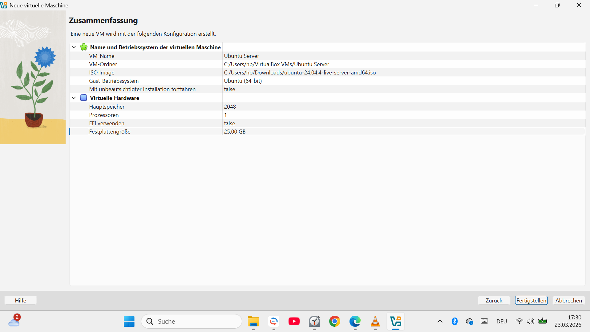
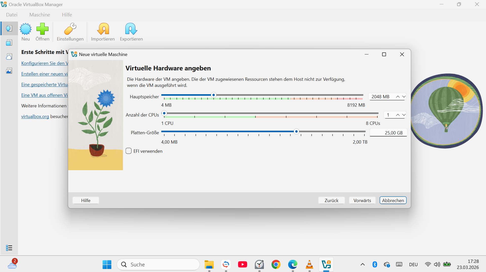
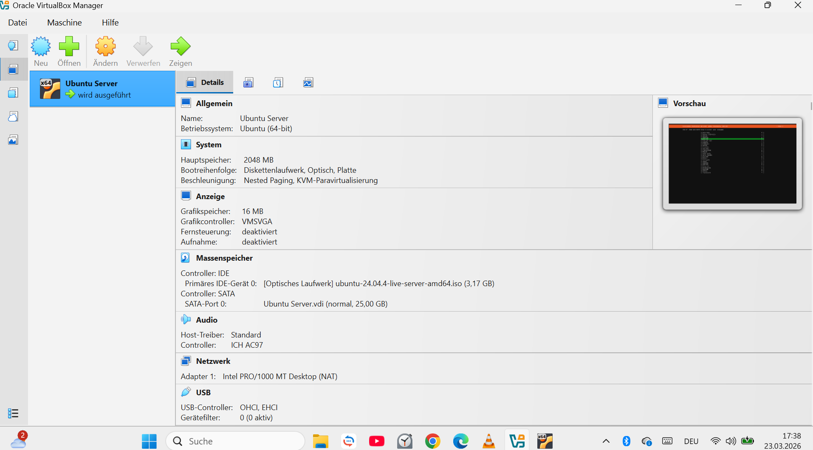
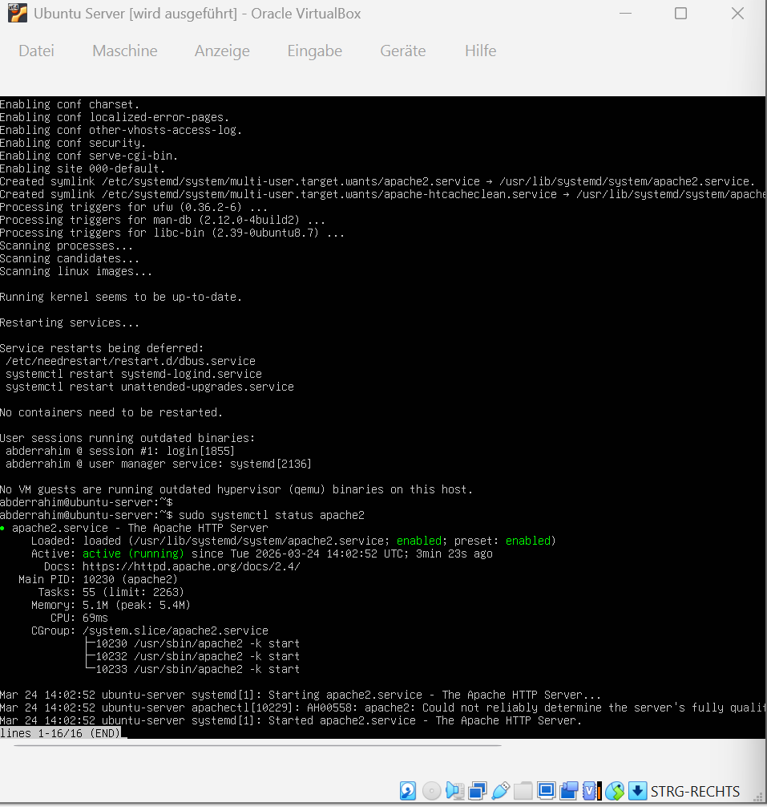
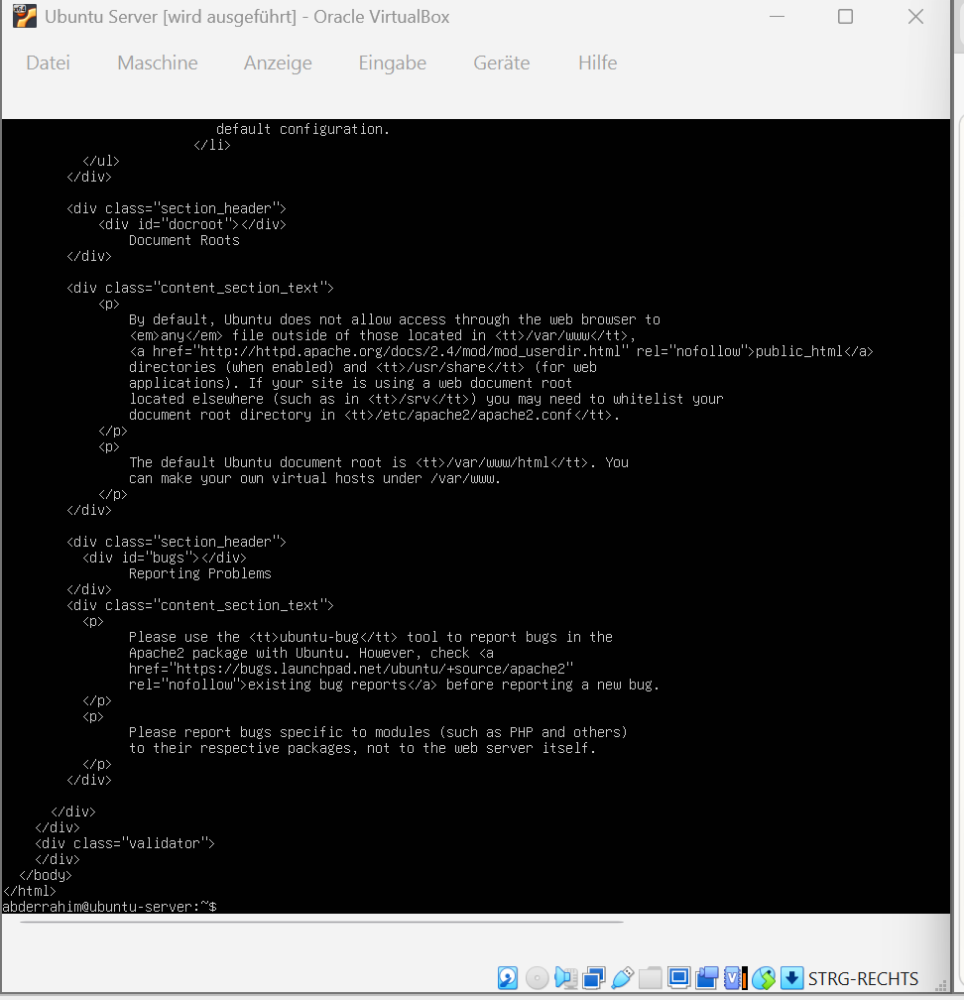

# Linux-Server-Projekt
Installation eines Ubuntu Servers und eines Apache Webservers
# Linux Server Projekt

## Ziel
In diesem Projekt habe ich einen Linux Server installiert und einen Webserver eingerichtet.

## Verwendete Software
- VirtualBox
- Ubuntu Server
- Apache Webserver

## Schritte

1. VirtualBox installiert
2. Virtuelle Maschine erstellt
3. Ubuntu Server installiert
4. System aktualisiert
5. Apache installiert

## Befehle

sudo apt update
sudo apt install apache2

## Ergebnis

Der Webserver läuft lokal innerhalb einer virtuellen Maschine (VirtualBox).
Ich konnte die Webseite über http://localhost öffnen.

## Screenshots

### VirtualBox

### VM erstellen

### Ubuntu Installation

### Webserver

### Befehle als Administrator

